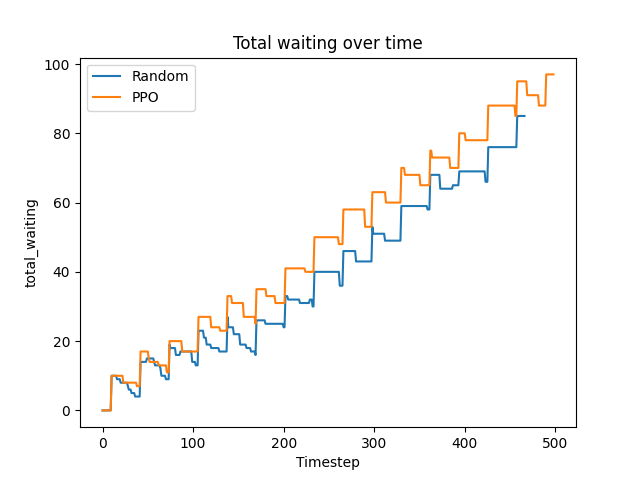
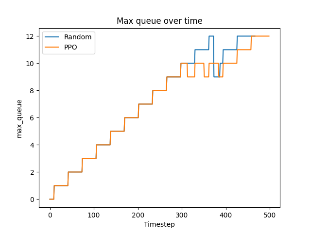
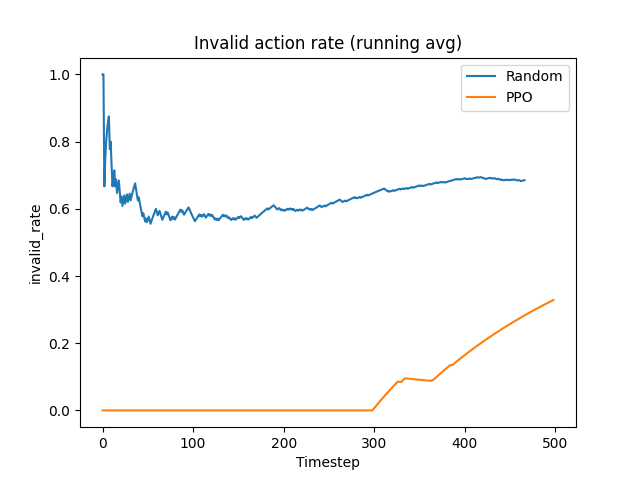
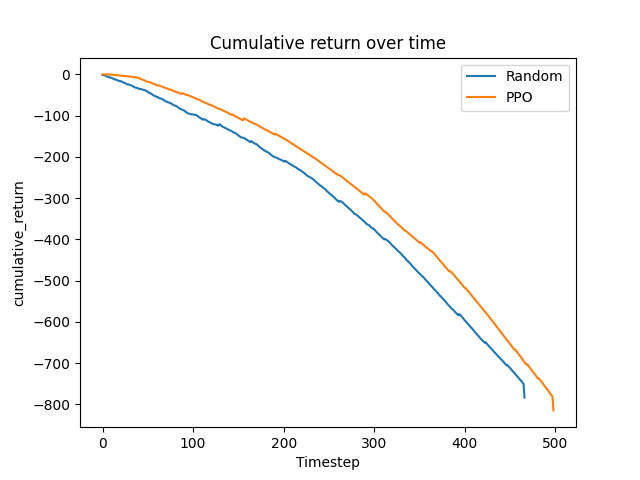
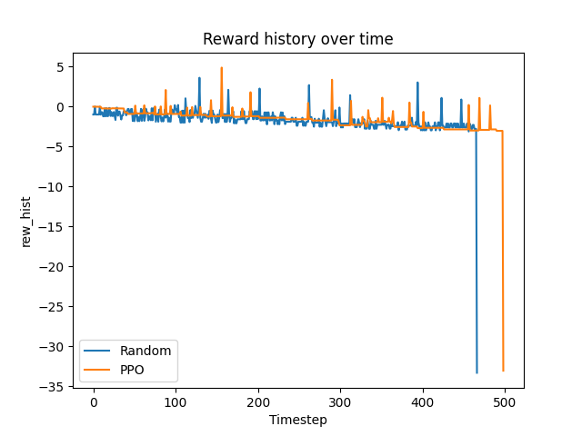

## Project Summary

We implemented a reinforcement learning agent to play Mini Metro in a custom simulation environment. The environment exposes a Gym-like API that allows the agent to observe the transit system state and choose high-level network editing actions from the custom game engine. These actions include creating, expanding, and replacing transit lines in order to manage congestion under growing passenger demand.

Our goal was to train a reinforcement learning agent that learns how to maintain a functional metro network over time while minimizing passenger waiting and avoiding station overflow failures. Designing metro networks is difficult because congestion evolves dynamically, and small structural changes in the network can have delayed system-wide effects. This makes the problem well suited for reinforcement learning, where an agent can learn strategies through interaction with the environment.

We train a **Proximal Policy Optimization (PPO)** agent to learn a control policy that maximizes survival time while minimizing passenger waiting and overcrowding. During development we also analyze how action design, reward structure, and invalid actions affect system stability and learning behavior.

For evaluation we compare the trained PPO agent against a random baseline policy that selects actions uniformly. By comparing these two policies we can determine whether the learned policy improves system performance beyond naive decision making.

## Approach
### Setup
We formualte this as a reinforcement learnig problem in a custom Mini Metro game engine, using Gymnasium environment. At each deision step, the agent observes the current metro network, choose a high level editing action, and then the simulator advances forward before the next decision is made. In our implementation, the internal simulatior runs with 16ms, while the agent only acts every 250ms, which aimed to reduces the frequency of decisions and make training stable. In addition, the game terminates when episodes reaches to 4000 steps, and when a station remians at capacity long enough to trigger overflow failture. 

To make sure the problem is more learnable, we do no expose the raw game UI controls to the agent. Instead, we simplify the action space into five high-level operations, implemented as `MultiDiscrete([total number actions, total number of stations, total number of stations])`. 

**Actions:**
* Do Nothing
* Creating a new path
* Expanding a path
* Removing and replacing a path
* Guided expansion action that connects a high demand station to an existing path

   
### Improvements
### Baseline approach
### PPO

## Evaluation

**Total Waiting Passengers**

The initial plot presents the aggregate waiting time, serving as an indicator of the agent's efficacy in managing passenger flow throughout the observed period. The data reveal that both agents exhibit an upward trend in total waiting time, an expected pattern given the environment's escalating difficulty. However, the evaluation indicates that the PPO agent generally has a longer total waiting time than the random model.

This suggests that, despite learning a policy, the PPO agent is not effectively minimizing congestion. A conclusion we reached is that the reward function tends to develop a bias toward actions that do not directly affect the flow of waiting passengers. This shows a common challenge in reinforcement learning, which is a misalignment between reward design and the expected system behavior.

**Maximum Queue Length**

Maximum queue length indicates how severe congestion gets at its worst point in the system, which is important because high values usually mean the system is close to failing. Looking at the results, both the PPO agent and the random agent behave pretty similarly. In both cases, the maximum queue keeps increasing over time and eventually reaches a similar critical level. The PPO agent doesn’t really do a better job than random at keeping the peak congestion levels under control.

This suggests that the agent isn’t effectively focusing on the stations that need the most attention or preventing bottlenecks from forming. Ideally, a stronger policy would keep those peaks lower or at least delay when they happen, but we don’t really see that here.

**Invalid Action Rate**

Invalid actions are when the agent tries to do something that isn’t allowed, like making a path change that doesn’t make sense. When this happens a lot, it usually means the agent doesn’t really understand how the environment works yet. This is actually where PPO improves the most compared to random. The random agent keeps making invalid moves most of the time, while the PPO agent brings that down a lot to about 30% by the end.

So even though PPO isn’t necessarily better at reducing congestion, it clearly learns what actions are valid and avoids doing obviously bad or impossible things. That’s a good sign that the agent is starting to understand the structure of the environment, even if it hasn’t fully figured out how to optimize performance yet.

**Cumulative Return over time**

Cumulative reward indicates how well the agent is performing overall under the reward system we designed. From the graph, the PPO agent consistently outperforms the random agent, indicating it is actually learning and optimizing for the rewards we provided. At the same time, both curves continue to decline over time, indicating that the environment becomes harder and penalties start to outweigh any positive rewards.

The important part here is that the PPO agent is learning, but it’s learning exactly what we told it to optimize, not necessarily what we actually care about. In this case, that means it follows the reward function well, but that reward function doesn’t fully reflect the real goal of reducing congestion. That gap between the reward and the true objective is one of the biggest limitations of our approach.

**Reward History**

The reward history shows how much reward the agent gets at each step, which helps us understand how stable its behavior is and how it’s learning over time. Looking at the graph, both agents have pretty noisy rewards, with random spikes at some points. The PPO agent looks a bit more consistent at the beginning. Still, over time, both agents end up with sharp drops in reward near the end of the episode, which usually means the system is failing, for example, overcrowded stations.

Overall, this tells us a few things. The environment itself is pretty unpredictable and hard to control; the agent never fully learns how to avoid those failure states, and by the end, most of the rewards are actually penalties rather than positive gains.

## Resources Used

We used the following resources during development:

Libraries
- Stable-Baselines3 (PPO implementation)
- Gymnasium environment API
- NumPy and Matplotlib
- PyGame for visualization

References
- Schulman, J., Wolski, F., Dhariwal, P., Radford, A., & Klimov, O. Proximal Policy Optimization Algorithms.
-- https://arxiv.org/abs/1707.06347

- Stable-Baselines3 Documentation
-- https://stable-baselines3.readthedocs.io

- Gymnasium Documentation
-- https://gymnasium.farama.org

- Mini Metro Simulation Engine
-- https://github.com/autosquash/python_mini_metro_extended

We also used ChatGPT for assistance in understanding reinforcement learning algorithms, debugging environment integration issues, and helping explain code behavior in the final report.
