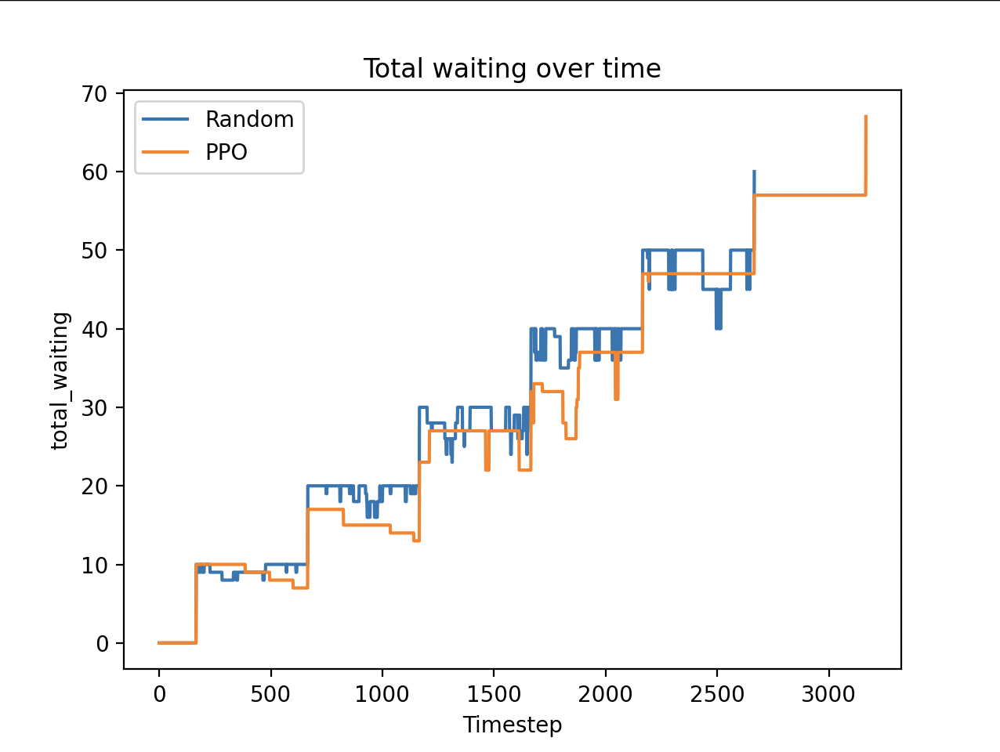
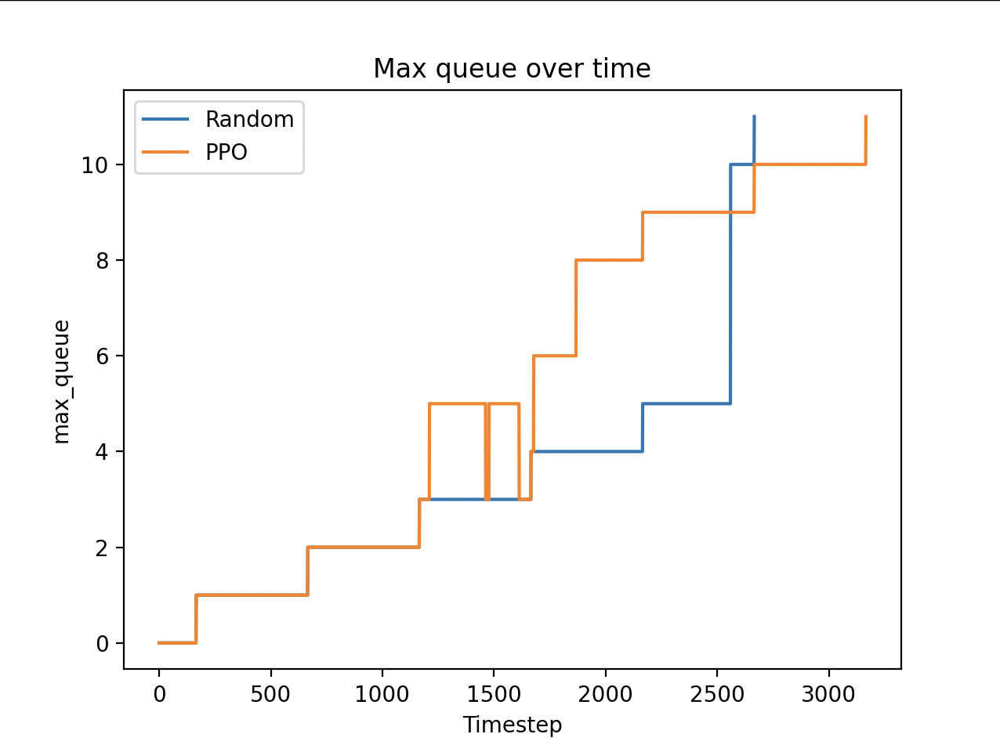
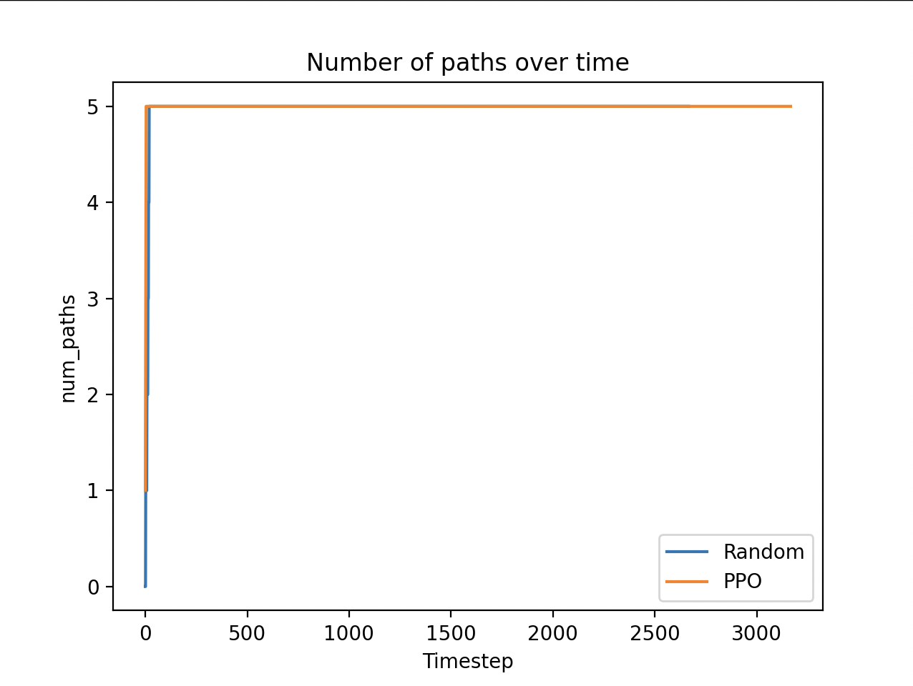
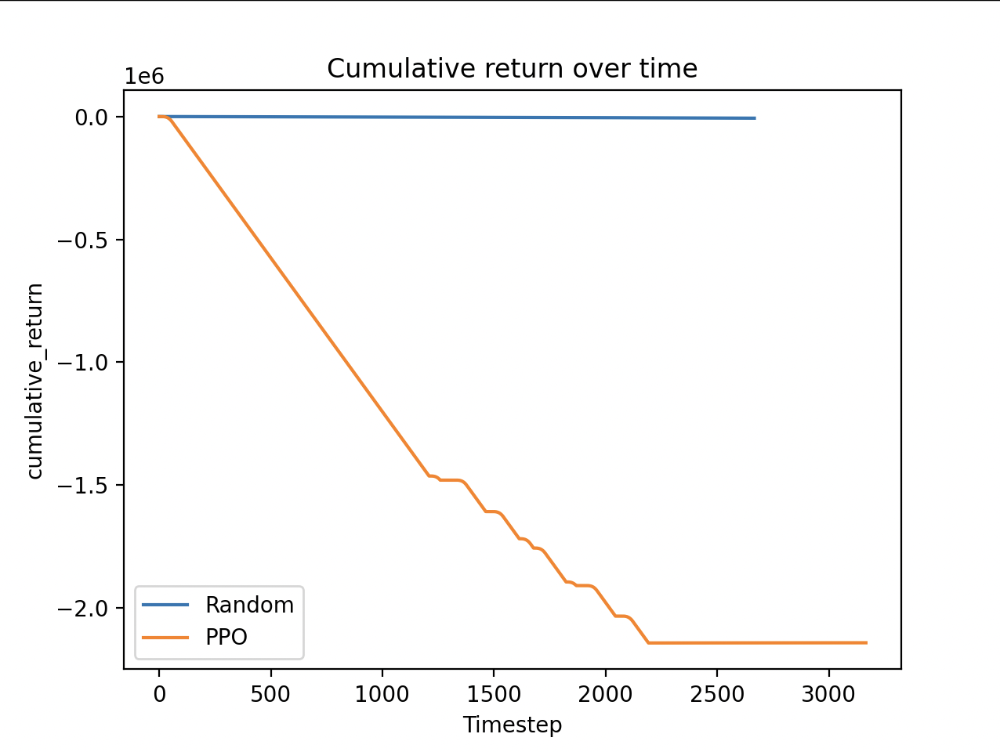
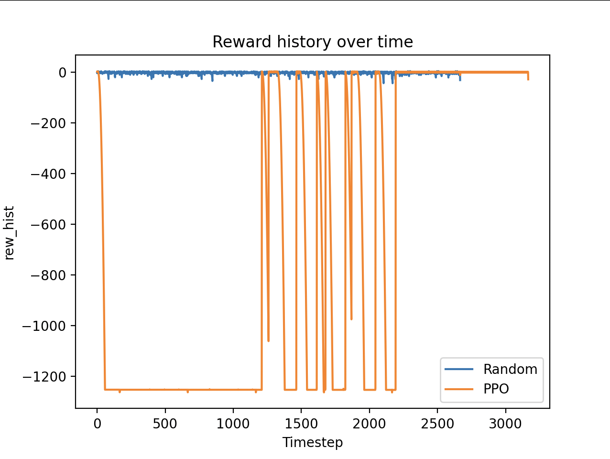
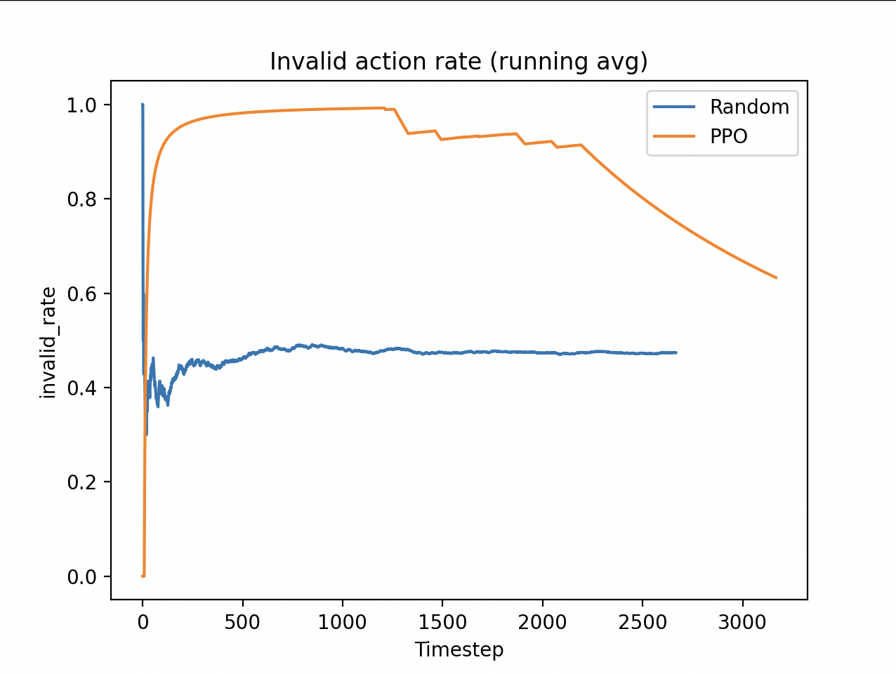

<iframe width="560" height="315" src="https://www.youtube.com/embed/F_l16_d591U?si=aEtLb6TOlWhCQzsB" title="YouTube video player" frameborder="0" allow="accelerometer; autoplay; clipboard-write; encrypted-media; gyroscope; picture-in-picture; web-share" referrerpolicy="strict-origin-when-cross-origin" allowfullscreen></iframe>

## Project Summary

We implemented a reinforcement learning agent to play Mini Metro in a custom simulation environment. The environment exposes a Gym-like API to help the agent to oberve the transit system state and choose high level network edit actions from the custom game engine. The actions include creating, expanding, and replacing transit lines to manage congestion under growing passenger demand. We train a Proximal Policy Optimization (PPO) agent to learn a control policy that maximizes survival time while minimizing passenger waiting and overcrowding. As well as analyzing how action design and reward structure affect system performance and stability.

## Approach

Our main algorithm to train an agent to play Mini Metro is Proximal Policy Optimization (PPO). This is an on policy algorithm that learns a neural network policy to approximate an optimal control strategy for metro network editions.

### Markov Decision Process
We model the game as an Markov Decision Process. At each timestep $t$, the agent receives an observation ($O_t$), selects an action ($A_t$), and the simulator advance by a fixed time step (detla t)

### State/Observation
We use a compact feature vector as the observation:

$$
O_t ​= [q_1​, …, q_N, d_1​, …, d_N​, P]
$$

- \\( q_i \\): the stataion  \( i \)'s current queue/occupation
- \\( d_i \\): the station \\( i \\)'s dgree (how many paths include the this station)
- \\( P \\): list containing [number of paths, number of stations, time]

### Action Space
We use discrete high level operatiors, implemeted as parameteried acitons such as (action id, \\( station_i \\) , \\( station_j \\)). Parameters are choosen by the agent.
- action 0: Do nothing
- action 1: create and connect \\( station_i \\) to \\( station_j \\)
- action 2: expand the network from \\( station_i \\) to \\( station_j \\)
- action 3: remove a low utility path, then create a new connection between most congested \\( station_i \\) and \\( station_j \\)
- action 4: connect a least connected but high demand \\( station_i \\) to \\( station_j \\)

### Reward 
We use reward to enovurages the policy to reduce crowding on stations and increase survial time by prevent overflow.

Reward is calcuate by different aspect, such as penalty on long queue/waiting time/action/remove line/invalid action/terminal or fail, and reward for build new line/ exapnd lines.

### PPO
We train the agent using Proximal Policy Optimization (PPO) 
 \\( q_i \\). (Schulman, J)

At each PPO iteration:
Collect n_steps transitions \\( (O_t, A_t, r_t, O_{t+1}) \\) using the current policy compute advantage estimates $\hat{A}_t$ optimize the PPO losses for n_epochs epochs over minibatches of size batch_size

PPO uses a clipped policy update. Define the probability ratio:

$$
\rho_t(\theta)=\frac{\pi_\theta(A_t \mid O_t)}{\pi_{\theta_{\text{old}}}(A_t \mid O_t)}
$$

$$
\mathcal{L}^{\text{CLIP}}(\theta)=\mathbb{E}_{t}\left[
\min\Big(
\rho_t(\theta)\hat{A}_t,\;
\text{clip}(\rho_t(\theta),1-\epsilon,1+\epsilon)\hat{A}_t
\Big)
\right]
$$

- \\( O_t \\): observation in step \\( t \\)
- \\( A_t \\): action in step \\( t \\)
- \\( r_t \\): reward in step \\( t \\)
- \\( \theta \\): current policy
- \\( \pi_\theta(A_t \mid O_t) \\): probability that the current policy assigns to taking action  \\( A_t \\) given observation \\( O_t \\)
- \\( \rho_t(\theta) \\): ratio between new and old action probability
- \\( \mathcal{L}^{\text{CLIP}} \\): PPO's clipped policy objective
- \\( \text{clip}(\rho_t(\theta),1-\epsilon,1+\epsilon) \\): clamps the ratio into \\( [1-\epsilon,1+\epsilon] \\) to prevent overly large policy updates
- \\( \hat{A}_t \\): advantage estimate at time \\( t \\)

### Exploration (PPO)
Exploration comes from:
- sampling actions from a stochastic policy \\( \pi_\theta(A_t \mid O_t) \\) during training 
- an entropy bonus controlled by `ent_coef` hyper-parameter, higher vlaue equal to more exploration

Exploration is still present when ent_coef = 0.0, since the policy is stochastic, but the algorithm is less explicitly encouraged to stay exploratory

### Neural Network
We use a MLP policy (`MlpPolicy`). For 1D feature observations, SB3’s default is a 2-layer fully-connected network with 64 units per layer for PPO. 

### Parameter Values

| Paramter      | Value     |
| :------------ | :-------- |
| policy        | MlpPolicy |
| n_steps       | 1024      |
| batch_size    | 256       |
| gamma         | 0.99      |
| gae_lambda    | 0.95      |
| learning_rate | 3e-4      |
| ent_coef      | 0.02      |
| vf_coef       | 0.5       |
| clip_range    | 0.2       |
| verbose       | 1         |

**Code Methods**
- Environment: `rl_env.py` (`MiniMetroRLEnv`)
- Observation/state features: `rl_env.py` → `_get_obs()`
- Reward + termination: `rl_env.py` → `step()`
- Action operators: `rl_env.py` → `_apply_action()`

## Evaluation
We are logging the agent’s reward progression and action statistics during training to monitor whether PPO is learning a stable control policy over time. In addition to cumulative return, we track per-action usage and invalid-action rates to understand how the agent is interacting with the environment. By visualizing reward curves and action distributions together, we can identify patterns such as action collapse, repeated invalid selections, or excessive penalty accumulation that negatively impact performance.

By correlating reward spikes and invalid-action streaks with specific operations (expansion or removal), we are able to diagnose when reward shaping or feasibility constraints are dominating learning. For example, large negative reward spikes revealed that penalty scaling was overwhelming the learning signal, causing the agent to accumulate extreme negative returns despite surviving for a similar number of steps as the random baseline. Using these insights, we iteratively adjust action indexing, feasibility checks, and reward scaling to reduce invalid loops and improve policy stability.

## Remaining Goals and Challenges

Our current prototype successfully trains a PPO agent and compares it to a random baseline, but evaluation remains limited. We plan to conduct multi-seed evaluations, compare our agent against stronger heuristic baselines, and systematically analyze the impact of reward design and action structure. We also aim to refine the action space to better capture realistic network planning decisions.

A key challenge is how delayed our credit assignment is. Structural network edits may have long-term effects that are difficult for PPO to learn. Additionally, the MultiDiscrete action space can produce invalid or low impact actions, slowing convergence. To address this, we plan to explore improved reward shaping and possibly action masking.

## Resources Used

We used a Stable-Baselines3 (PPO), Gymnasium, and an open-source Mini Metro simulation repository as the foundation of our environment. We also used ChatGPT as a source to explain the source code for us to understand, and helped us debug environment integration issues.

Stable-Baslines3:
- https://stable-baselines3.readthedocs.io/en/master/guide/custom_env.html

PPO Algorithms:
- Schulman, J., Wolski, F., Dhariwal, P., Radford, A., & Klimov, O. (2017, July 20). Proximal Policy optimization Algorithms. arXiv.org. https://arxiv.org/abs/1707.06347

Gymnasium:
- https://gymnasium.farama.org

Python custom mini metro game engine:
- https://github.com/autosquash/python_mini_metro_extended
